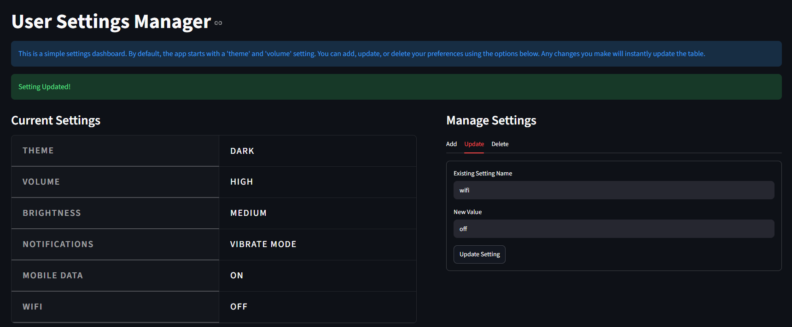

# User Settings Manager

A dynamic, session-state-based configuration dashboard built with Python. 

## Preview

**🔗 [View Live Application](https://jatinp-settings.streamlit.app/)**

## Overview
This application provides a centralized interface for managing user preferences. It uses Streamlit's session state functionality to process data operations (Create, Read, Update, Delete) in real-time without requiring backend database integration.

## Core Features
* **State Management:** Instantly updates data tables upon form submission using `st.session_state`.
* **Input Validation:** Prevents duplicate key entries, empty submissions, and handles missing data errors gracefully.
* **Interface Optimization:** Integrates custom styling to remove default visual clutter, ensuring a clean and distraction-free user experience.

## Technical Stack
* **Language:** Python
* **Framework:** Streamlit

## Deployment
This application is deployed via Streamlit Community Cloud.

**Live Application:** https://jatinp-settings.streamlit.app/
